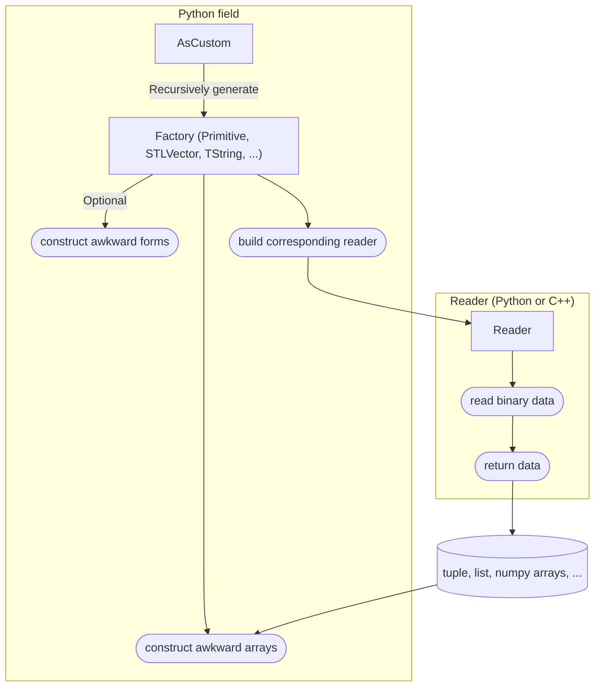

# Introduction

Uproot-custom is an extension of [Uproot](https://uproot.readthedocs.io/en/latest/basic.html) that provides an enhanced way to read custom classes stored in `TTree`.

## What uproot-custom can do

Uproot-custom can natively read complicated combinations of nested classes and c-style arrays (e.g. `map<int, map<int, map<int, string>>>`, `vector<TString>[3]`, etc), and memberwisely stored classes. It also exposes a way for users to implement their own readers for custom classes that are not supported by Uproot or uproot-custom built-in readers.

## When to use uproot-custom

Uproot-custom aims to handle cases that classes are too complex for Uproot to read, such as when their `Streamer` methods are overridden or some specific data members are not supported by Uproot.

## How uproot-custom works

Uproot-custom uses a Reader / Factory mechanism to read classes:

- `Reader` is a class that implements the logic to read data from binary buffers. It can be written in **Python** (for development and debugging) or **C++** (for production performance).
- `Factory` is a Python class that creates, combines `Reader`s, and post-processes the data read by `Reader`s.

This mechanism is implemented as `AsCustom` interpretation. This makes uproot-custom well compatible with Uproot.

> [!TIP]
> Users can implement their own Factory and Reader, register them to uproot-custom. Start with a **Python reader** for rapid prototyping, then port the logic to **C++** for production speed. The default reader backend is C++; during development, explicitly set the backend to Python. An example of implementing a custom Factory / Reader can be found in [the example repository](https://github.com/mrzimu/uproot-custom-example).

> [!NOTE]
> Uproot-custom does not provide a full reimplementation of `ROOT`'s TTree I/O system. Users are expected to implement their own Factory / Reader for their custom classes that built-in factories cannot handle.

## System Requirements

- **C++17 compatible compiler**: Required for building C++ readers and the uproot-custom extension module. The CMake configuration sets `CMAKE_CXX_STANDARD 17`.
- **Python 3.9+**: Uproot-custom supports Python 3.9 through 3.13.

## Documentation

View the [documentation](https://mrzimu.github.io/uproot-custom/) for more details about customizing your own `reader`/`factory`, the architecture of uproot-custom, and build-only dependencies (e.g., `pybind11` is needed only at build time and should not be present in the runtime environment).
